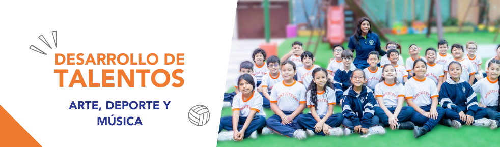
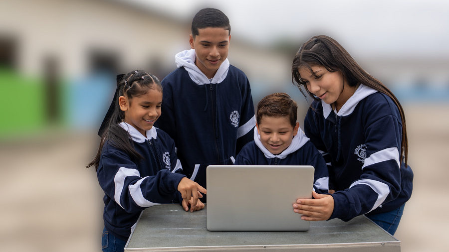
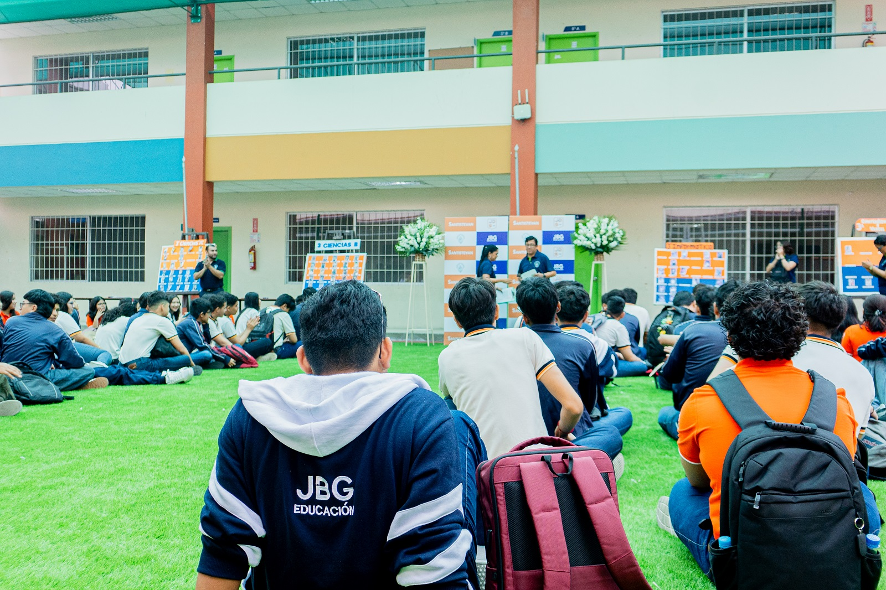
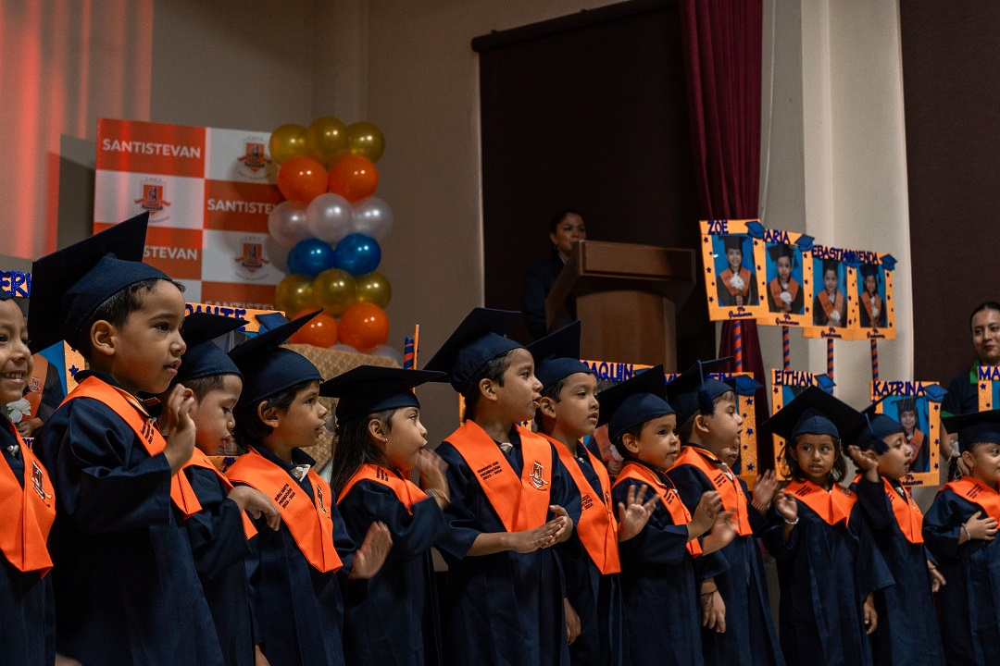

<!DOCTYPE html>
<html lang="es">
<head>
    <meta charset="UTF-8">
    <meta name="viewport" content="width=device-width, initial-scale=1.0">
    <title>Unidad Educativa José D. de Santistevan - Formación Humana y Excelencia Académica</title>
    <link rel="stylesheet" href="esti.css">
    </head>
<body>
    <header class="header">
        

            <h1 class="logo">
                <a href="colegio.html">
                    
                    

                        UNIDAD EDUCATIVA
                        JOSÉ D. DE SANTISTEVAN
                        JUNTA DE BENEFICENCIA
                    

                </a>
            </h1>
            <nav class="nav-menu">
                <ul>
                    <li><a href="colegio.html" class="active">Inicio</a></li>
                    <li><a href="menu/acerca.html">Quiénes Somos</a></li>
                    <li><a href="menu/programas.html">Programas Académicos</a></li>
                    <li><a href="menu/admisiones.html">Admisiones</a></li>
                    <li><a href="menu/contacto.html">Contacto</a></li>
                </ul>
            </nav>
            

                
                
                
            

        

    </header>

    <main>
        <section class="hero-section">
            

            

                <h1>Formación Humana y Excelencia Académica</h1>
                
En la Unidad Educativa José D. de Santistevan, educamos con valores y preparamos a nuestros estudiantes para un futuro brillante.

                <a href="menu/admisiones.html" class="btn">Proceso de Admisión</a>
                <a href="menu/acerca.html" class="btn btn-outline">Conócenos Más</a>
            

        </section>

        <section class="section-padding about-overview">
            

                

                    <h2 class="section-title text-left">Nuestra Esencia: Formación Humana</h2>
                    
La Unidad Educativa Particular "JOSÉ D. DE SANTISTEVAN" es una institución dedicada a la formación integral de sus estudiantes, en valores, conocimientos y competencias que permitan alcanzar la excelencia académica.

                    
Nuestra filosofía se centra en el desarrollo de individuos con sensibilidad social, conscientes de su entorno y con la capacidad de transformar positivamente la sociedad. Promovemos un ambiente de respeto, creatividad y constante superación.

                    <a href="menu/acerca.html" class="btn btn-primary">Ver Quiénes Somos</a>
                

                

                    
                    

            

        </section>

        <section class="section-padding section-light-bg">
            

                <h2 class="section-title">Pilares de Nuestra Educación</h2>
                
Construimos el futuro sobre bases sólidas de valores, innovación y compromiso académico.

                

                    

                        💡 <h3>Pensamiento Crítico</h3>
                        
Desarrollamos la capacidad de análisis y juicio para la toma de decisiones informadas.

                    

                    

                        🌱
                        <h3>Valores Éticos</h3>
                        
Inculcamos principios morales y cívicos para una convivencia armónica y responsable.

                    

                    

                        🤝
                        <h3>Innovación Educativa</h3>
                        
Integramos metodologías y herramientas de vanguardia para un aprendizaje dinámico.

                    

                    

                        🏆
                        <h3>Excelencia Académica</h3>
                        
Motivamos el máximo rendimiento a través de un currículo desafiante y docentes dedicados.

                    

                

            

        </section>

        <section class="cta-section">
            

                <h2>Tu Futuro Comienza Aquí</h2>
                
Descubre cómo la Unidad Educativa José D. de Santistevan puede transformar la trayectoria académica y personal de tu hijo.

                <a href="menu/contacto.html" class="btn">Contáctanos Hoy</a>
            

        </section>

        <section class="section-padding">
            

                <h2 class="section-title">Últimas Noticias y Eventos</h2>
                
Mantente informado sobre las actividades, logros y novedades de nuestra comunidad Santistevan.

                

                    

                        
                        

                            <h3>La Junta de Beneficencia expande su red educativa con un modelo innovador</h3>
                            
Este año, la JBG duplicará su matrícula y alcanzará 5.000 estudiantes gracias a su modelo educativo innovador y su expansión nacional. • Esta ampliación

                            9 de Mayo, 2025
                            <a href="#" class="btn btn-primary" style="margin-top: 15px; padding: 10px 20px; font-size: 0.9em;">Leer más</a>
                        

                    

                    

                        
                        

                            <h3>Sector Educativo de la JBG invierte en nuevos proyectos de educación para el futuro</h3>
                            
La Junta de Beneficencia de Guayaquil (JBG) cuenta con dos comunidades educativas centenarias: José Domingo de Santistevan y Santa Luisa de Marillac con

                            20 de Mayo, 2025
                            <a href="#" class="btn btn-primary" style="margin-top: 15px; padding: 10px 20px; font-size: 0.9em;">Leer más</a>
                        

                    

                    

                        
                        

                            <h3>Aprendices de Inicial 2 se graduaron con honores</h3>
                            
Durante su tiempo en nuestra institución, estos pequeños han demostrado una dedicación excepcional, una curiosidad innata y una creatividad inspiradora.

                            15 de Febrero, 2024
                            <a href="#" class="btn btn-primary" style="margin-top: 15px; padding: 10px 20px; font-size: 0.9em;">Leer más</a>
                        

                    

                

            

        </section>

        <section class="section-padding section-light-bg text-center">
            

                <h2 class="section-title">Video Institucional</h2>
                
Conoce más sobre la experiencia Santistevan a través de nuestro video oficial.

                

                    <iframe width="760" height="615" src="https://www.youtube.com/embed/YI2PZ2fzWoM?si=MAa61WqIkIZJp6Of" title="YouTube video player" frameborder="0" allow="accelerometer; autoplay; clipboard-write; encrypted-media; gyroscope; picture-in-picture; web-share" referrerpolicy="strict-origin-when-cross-origin" allowfullscreen></iframe>
                

            

        </section>

    </main>

    <footer class="footer">
        

            

                <h3> U.E. Santistevan</h3>
                
Educando con valores, formando líderes del mañana.

                <address>
                    Av. Principal 123, Ciudad, País 
                    Teléfono: <a href="tel:+593987654321">+593 987 654 321</a> 
                    Email: <a href="mailto:info@santistevan.edu.ec">info@santistevan.edu.ec</a>
                </address>
            

            

                <h3>Enlaces Rápidos</h3>
                <ul>
                    <li><a href="index.html">Inicio</a></li>
                    <li><a href="pages/acerca.html">Quiénes Somos</a></li>
                    <li><a href="pages/programas.html">Programas Académicos</a></li>
                    <li><a href="pages/admisiones.html">Admisiones</a></li>
                    <li><a href="pages/contacto.html">Contacto</a></li>
                </ul>
            

            

                <h3>Recursos</h3>
                <ul>
                    <li><a href="#">Calendario Escolar</a></li>
                    <li><a href="#">Guía del Saber</a></li>
                    <li><a href="#">Consejo Estudiantil</a></li>
                    <li><a href="#">Seguro Estudiantil</a></li>
                    <li><a href="#">Encuesta de Satisfacción</a></li>
                </ul>
            

            

                <h3>Síguenos</h3>
                    

                    <a href="https://www.facebook.com/jbgorg" aria-label="Facebook"><i class="fab fa-facebook-f"></i></a>
                    <a href="https://www.instagram.com/juntadebeneficencia.ec/" aria-label="Instagram"><i class="fab fa-instagram"></i></a>
                    <a href="https://x.com/jbgorg" aria-label="Twitter"><i class="fab fa-twitter"></i></a>
                    <a href="https://www.youtube.com/@juntadebeneficencia" aria-label="YouTube"><i class="fab fa-youtube"></i></a>
                

            

        

        

            
© 2025 Unidad Educativa José D. de Santistevan. , Fausto  Adrian López Vélez. Todos los derechos reservados.

        

    </footer>

    
</body>
</html>
